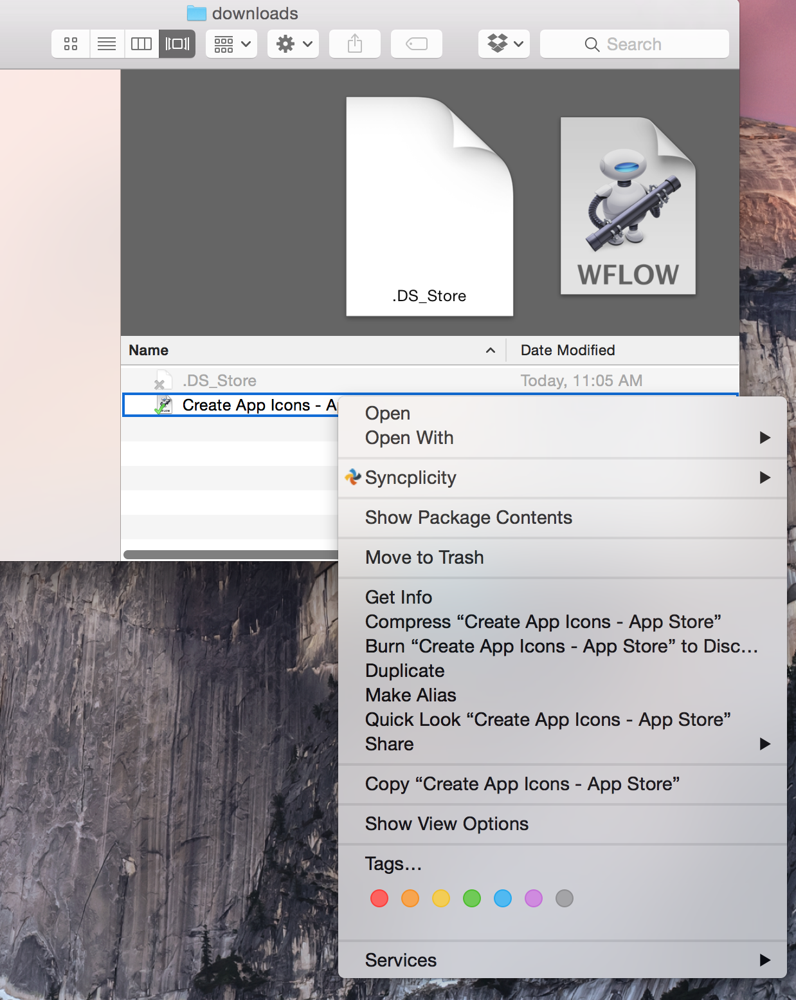

# ios-app-store-icons
Automator script to generate iOS app store icons in all sizes. Updated for iOS8 and iPhone 6.

## Usage
1. Either clone this project or download the automator workflow file: Create App Icons - App Store.workflow.

2. Right-click the workflow file and choose Open:

3. Ignore the warning and choose Install:

4. Create a new folder that only includes a base icon sized at 1024X1024 named icon.png.

5. Rick click the file and choose Services -> Create App Icons - App Store:

6. That's all. You now have all the necessary icons. Drag these into your XCode Image Catalog:

